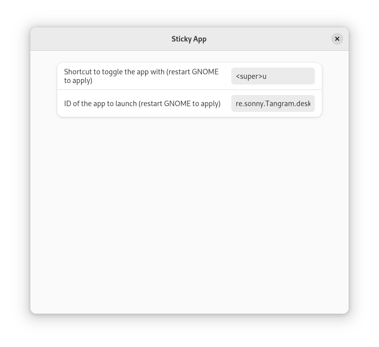

# Sticky App

A GNOME shell extension to toggle an app's visibility.

## Overview

Sticky app adds a new global shortcut that toggles an app's visibility; by default it binds <kbd>super</kbd>+<kbd>u</kbd> to toggle GNOME Terminal.

## Installation

To install Sticky App, run the following:

```shell
$ git clone https://github.com/pojntfx/gnome-shell-extension-sticky-app.git /tmp/gnome-shell-extension-sticky-app
$ cd /tmp/gnome-shell-extension-sticky-app
$ make install
```

Now, install https://extensions.gnome.org/extension/2639/hide-minimized/ to hide the minimized app from the overview.

Finally, log out and login again, and you can toggle GNOME Terminal with the shortcut specified above.

## Usage

You can set a different shortcut and app ID by visiting https://extensions.gnome.org/local/ and opening the Sticky App settings:



Please note that you need to log out and login again before the changes will be applied.

## Contributing

To contribute, please use the [GitHub flow](https://guides.github.com/introduction/flow/) and follow our [Code of Conduct](./CODE_OF_CONDUCT.md).

To build and start a development version of Sticky App locally, run the following:

```shell
$ git clone https://github.com/pojntfx/gnome-shell-extension-sticky-app.git
$ cd gnome-shell-extension-sticky-app
$ make depend
$ make run
```

## License

Sticky App (c) 2022 Felicitas Pojtinger and contributors

SPDX-License-Identifier: AGPL-3.0
